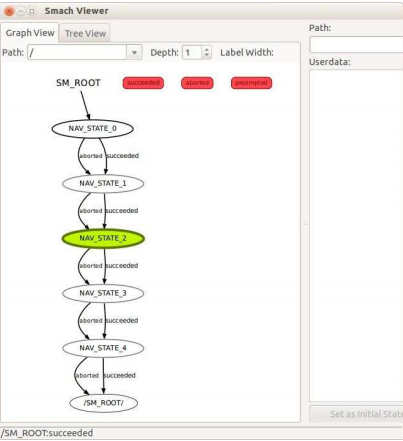

# 3.8.3 Тестирование SMACH навигации в симуляторе ArbotiX

Попробуем запустить скрипт _patrol\_smach.py_ с помощью симулятора ArbotiX.

Сначала запустите файл _fake\_turtlebot.launch_ в пакете _rbx2\_tasks_. Этот файл вызовет фальшивый TurtleBot, сервер действий move\_base с пустой картой и фальшивый симулятор батареи со стандартным временем выполнения 60 секунд, хотя мы не будем использовать батарею для этого примера:

```text
$ roslaunch rbx2_tasks fake_turtlebot.launch
```

Далее, завершите все запущенные экземпляры RViz, затем вызовите его с помощью конфигурационного файла _Nav\_tasks_ :

```text
$ rosrun rviz rviz -d `rospack find rbx2_tasks`/nav_tasks.rviz
```

Убедитесь, что на переднем плане видно окно RViz, затем запустите скрипт _patrol\_smach.py_ :

```text
$ rosrun rbx2_tasks patrol_smach.py
```

Вы должны увидеть, как робот три раза двигается по квадрату, а затем останавливается. Вид в RViz должен выглядеть примерно так:


В то же время, в терминале, который вы использовали для запуска скрипта _patrol\_smach.py ,_  должны появиться следующие сообщения:


Здесь мы видим, что SMACH сообщает, когда происходит переход в каждое состояние, а также конечный результат работы машины состояния в целом. Строки, которые сообщают "Success rate" являются чем-то дополнительным, созданным нашим скриптом _patrol\_smach.py,_ который мы рассмотрим более подробно в следующем разделе.

Мы также можем посмотреть график работающей машины состояния с помощью утилиты _smach\_viewer.py_. Чтобы запустить просмотрщик, откройте другой терминал и запустите его:

```text
$ rosrun smach_viewer smach_viewer.py
```

Теперь снова запустите скрипт _patrol\_smach.py_ :

```text
$ rosrun rbx2_tasks patrol_smach.py
```

Дисплей в программе просмотра SMACH должен выглядеть примерно так:



По мере перемещения робота из состояния в состояние \(т.е. из местоположения в местоположение вокруг квадрата\), в окне просмотра должно появиться соответствующее состояние, выделенное зеленым цветом. Полное описание GUI вики-просмотрщика SMACH смотрите на странице [smach\_viewer](http://wiki.ros.org/smach_viewer).

